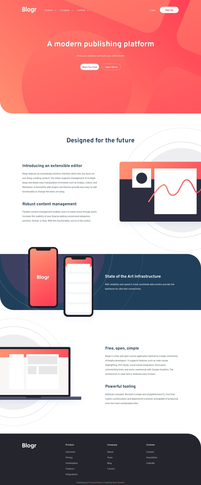

# Frontend Mentor - Blogr landing page solution

This is a solution to the [Blogr landing page challenge on Frontend Mentor](https://www.frontendmentor.io/challenges/blogr-landing-page-EX2RLAApP). Frontend Mentor challenges help improve coding skills by building realistic projects. 

## Table of contents

- [Overview](#overview)
  - [The challenge](#the-challenge)
  - [Screenshot](#screenshot)
  - [Links](#links)
- [My process](#my-process)
  - [Built with](#built-with)
  - [What I learned](#what-i-learned)
  - [Continued development](#continued-development)
- [Author](#author)
- [Acknowledgments](#acknowledgments)

## Overview

### The challenge

Users should be able to:

- View the optimal layout for the site depending on their device's screen size
- See hover states for all interactive elements on the page

### Screenshot



### Links

- Solution URL: [solution URL](https://www.frontendmentor.io/solutions/responsive-blogr-landing-page-solution-ZPd9ZaLGEG)
- Live Site URL: [Live site](https://ilham-bouk.github.io/Blogr_landing_page/)

## My process

### Built with

- Semantic HTML5 markup
- CSS custom properties
- Flexbox
- Desktop-first workflow

### What I learned

This challenge provided valuable practice for my coding skills, particularly in styling backgrounds and images.

```css
header::after {
  background-size: 220.5%;
  background-position-x: 25.3%;
  background-position-y: 52.16%;
}
``` 

### Continued development

I intended to add features that close one submenu when another is opened, but I forgot to implement this.

## Author

- Frontend Mentor - [@ilham-bouk](https://www.frontendmentor.io/profile/ilham-bouk)
- LinkedIn - [Ilham Bouktir](https://www.linkedin.com/in/ilham-bouktir-0b266b31b)

## Acknowledgments

A big thank you to anyone providing feedback on [my solution](https://www.frontendmentor.io/solutions/responsive-blogr-landing-page-solution-ZPd9ZaLGEG). It definitely helps to find new ways to code and find easier solutions!

**Happy coding!** ☺️🚀
